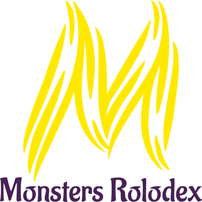

<!-- All batches -->
[![GitHub package.json version][GitHub-version]]()
[![GitHub last commit][commit]]()
[![Issues][issues-shield]][issues-url]
[![MIT License][license-shield]][license-url]
[![LinkedIn][linkedin-shield]][linkedin-url]
[](https://app.netlify.com/sites/rm-monster-rolodex/deploys)

<!-- PROJECT LOGO -->
<br>
<p align="center">
  <a href="https://github.com/rirtakmanna/Monster-Rolodex">
  
</a>
<h2 align="center">Monster Rolodex</h2>
<p align="center">
  A fun project using the filter list feature
  <br />
  <a href="https://github.com/rirtakmanna/Monster-Rolodex/blob/master/README.md"><strong>Explore the docs »</strong></a>
  <br />
  <br />
  <a href="https://rm-Monster-Rolodex.netlify.app" target="_blank">View Demo</a>
  ·
  <a href="https://github.com/rirtakmanna/Monster-Rolodex/issues">Report Bug</a>
  ·
  <a href="https://github.com/rirtakmanna/Monster-Rolodex/issues">Request Feature</a>
</p>
</p>

<!-- TABLE OF CONTENTS -->
## Table of Contents

- [Table of Contents](#table-of-contents)
- [About The Project](#about-the-project)
- [:clipboard: Built With](#clipboard-built-with)
- [:open_file_folder: Monster Rolodex Structure](#open_file_folder-monster-rolodex-structure)
- [:checkered_flag: Getting Started](#checkered_flag-getting-started)
- [Prerequisites](#prerequisites)
- [:sparkles: Installation](#sparkles-installation)
- [Usage](#usage)
- [:round_pushpin: Roadmap](#round_pushpin-roadmap)
- [:v: Contributing](#v-contributing)
- [:memo: License](#memo-license)
- [Author](#author)

<!-- ABOUT THE PROJECT -->
## About The Project

[![Product Name Screen Shot][product-screenshot]](https://rm-Monster-Rolodex.netlify.app)

Monster Rolodex is a fun website using react application. Its use array filter feature and react state update feature to filter the search field.

### :clipboard: Built With
>I build This project with this framwork:

* [React](https://reactjs.org/)
* [BabelJs](https://babeljs.io/)
* [SASS](https://sass-lang.com/)
## :open_file_folder: Monster Rolodex Structure
>You will have a very simple folder structure:

```
Monster Rolodex
├── README.md
├── package.json
├── LICENSE.md
├── .gitignore
├── public
│   ├── Favricon
│   ├── index.html
├── src
│   ├── Component (All Rect Component)
│   ├── SCSS
│   ├── App.js
│   ├── App.scss
│   ├── index.js
│   ├── index.scss
└── Build (File for production)
```


<!-- GETTING STARTED -->
## :checkered_flag: Getting Started
>To get a local copy up and running follow these simple example steps.
### Prerequisites
* npm
```sh
npm install npm@latest -g
```
### :sparkles: Installation
1. Clone the repo
```sh
git clone https://github.com/rirtakmanna/Monster-Rolodex.git
```
2. Install NPM packages
```sh
npm install
```
<!-- USAGE EXAMPLES -->
## Usage


<!-- ROADMAP -->
## :round_pushpin: Roadmap
See the [open issues](https://github.com/rirtakmanna/Monster-Rolodex/issues) for a list of proposed features (and known issues).

<!-- CONTRIBUTING -->
## :v: Contributing
Any contributions you make are **greatly appreciated**.

1. Fork the Project
2. Create your Feature Branch (`git checkout -b feature/AmazingFeature`)
3. Commit your Changes (`git commit -m 'Add some AmazingFeature'`)
4. Push to the Branch (`git push origin feature/AmazingFeature`)
5. Open a Pull Request

## :memo: License

Copyright © 2020 [Rirtak Manna](https://github.com/rirtakmanna).<br />
This project is [MIT](https://github.com/rirtakmanna/Monster-Rolodex/blob/master/LICENSE.md) licensed.

## Author

👤 **Rirtak Manna**

- Website: http://rirtakmanna.com
- Twitter: [@manna_rirtak](https://twitter.com/manna_rirtak)
- Github: [@rirtakmanna](https://github.com/rirtakmanna)

<!-- All links  -->
[GitHub-version]: https://img.shields.io/github/package-json/v/rirtakmanna/Monster-Rolodex
[commit]: https://img.shields.io/github/last-commit/rirtakmanna/Monster-Rolodex?color=green
[issues-shield]: https://img.shields.io/github/issues/rirtakmanna/Monster-Rolodex
[issues-url]: https://github.com/rirtakmanna/Monster-Rolodex/issues
[license-shield]: https://img.shields.io/badge/license-MIT-red
[license-url]: https://github.com/rirtakmanna/Monster-Rolodex/blob/master/LICENSE.md
[linkedin-shield]: https://img.shields.io/twitter/follow/manna_rirtak?label=Twitter
[linkedin-url]: https://linkedin.com/in/manna_rirtak
[product-screenshot]: ./src/assets/webbrowser.gif

